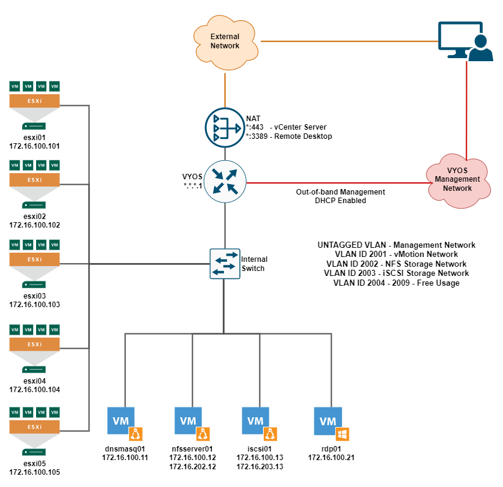

# vSphere LAB

Ansible Playbooks to manage one or more vSphere 7 Lab created in an isolated manner inside a vCenter Server.

Each vSphere LAB deployment creates several ESXi 7 servers, with a vCenter Server 7 ready to be configured, an iSCSI and a NFS storage for testing, DNS and DHCP services, and a Windows Server station to be used as the student desktop.

The whole infrastructure is based on nested virtualization, so no baremetal servers are necessary for its installation. For now, it is only deployable using a vCenter Server instance already available and configured. Deployment directly on ESXi Servers or VMware Workstation versions will be available soon.

---



---

#### Table of contents

- [vSphere LAB](#vsphere-lab)
      - [Table of contents](#table-of-contents)
  - [1. Introduction](#1-introduction)
  - [2. Setup and Pre-reqs](#2-setup-and-pre-reqs)
    - [2.1 Python environment](#21-python-environment)
      - [2.1.1 Alternative route](#211-alternative-route)
    - [2.2 Ansible collections and roles](#22-ansible-collections-and-roles)
    - [2.3 OS extra packages](#23-os-extra-packages)
  - [3. Playbooks, roles and related configurations](#3-playbooks-roles-and-related-configurations)
    - [3.1 Playbooks](#31-playbooks)
    - [3.2 Roles](#32-roles)
    - [3.3 Configurations](#33-configurations)
  - [4. Usage](#4-usage)
  - [5. Laboratory Overview](#5-laboratory-overview)
  - [6. Authors](#6-authors)
  - [7. Acknowledgements](#7-acknowledgements)

---

## 1. Introduction

This project aims to help virtualization administrators to build an isolated and temporary vSphere 7 laboratory infrastructure for practicing and testing purposes. Once deployed, the administrator has access to several building blocks necessary to put up a full virtualization infrastructure using vSphere 7, which can be used to study and validate vSphere 7 features, such as vSphere DRS and Storage DRS, vSphere vMotion, vSphere Lifecycle Manager, and many others.

The infrastructure is also prepared to add other products, like VMware vSAN, vSphere 7 with Tanzu, VMware NSX-T. Parameters used in the deployment playbook may be changed to better serve the laboratory purpose.

It is possible to deploy several laboratories in the same vSphere Cluster, limited only by the cluster capacity and the Virtual Distributed Switch upper limit per host. Then, feel free to deploy as many labs your team needs, as many times you find necessary.

**!!! IMPORTANT !!!**

The code provided in this repository is suited for lab environment deployment only.

---

## 2. Setup and Pre-reqs

First of all, clone this repository for you file system. For the setup purpose, we suggest you use an environment with Python 3, Pipenv and Pyenv (it helps setting up the environment). However, it is possible to use Python 3 directly with the installed modules. 

Throughout this item, an Ubuntu/Debian OS will be considered. But this project may be used with Enterprise Linux distributions as well.

### 2.1 Python environment

Install python packages, python3 and python3-pip, and the install Pipenv module.

~~~
sudo apt update
sudo apt install python3 python3-pip
pip install pipenv
~~~

Then, install Pyenv. You may follow the documentation in [Github](https://github.com/pyenv/pyenv) or execute the commands below if Debian or Ubuntu is being used:

~~~
sudo apt-get update
sudo apt-get install make build-essential libssl-dev zlib1g-dev \
                     libbz2-dev libreadline-dev libsqlite3-dev wget curl llvm \
                     libncursesw5-dev xz-utils tk-dev libxml2-dev libxmlsec1-dev libffi-dev liblzma-dev

git clone https://github.com/pyenv/pyenv.git ~/.pyenv

echo 'export PYENV_ROOT="$HOME/.pyenv"' >> ~/.bashrc
echo 'command -v pyenv >/dev/null || export PATH="$PYENV_ROOT/bin:$PATH"' >> ~/.bashrc
echo 'eval "$(pyenv init -)"' >> ~/.bashrc
~~~

Once installed Pyenv, inside the repository directory, initiate the virtual environment with the following commands:

~~~
pipenv shell
pipenv sync
~~~

All necessary Python modules and also the Python 3.9 will be installed. The python of this virtual environment will need to be referenced later in configurations files.

#### 2.1.1 Alternative route

If you do not wish to install the whole setup for your Python 3 environement, you may use the OS Python executable, and install the necessary modules below:

* ansible (tested version == 5.2.0)
* paramiko (tested version == 2.9.2)
* pyvmomi (tested version == 7.0.3)

### 2.2 Ansible collections and roles

For the vSphere LAB deployment, it is necessary to install the following Roles and Collections:

* Collection [community.vmware](https://docs.ansible.com/ansible/latest/collections/community/vmware/index.html)
* Role [ahuffman.resolv](https://github.com/ahuffman/ansible-resolv)
* Role [mrlesmithjr.nfs-server](https://github.com/mrlesmithjr/ansible-nfs-server)
* Role [ondrejhome.targetcli](https://github.com/OndrejHome/ansible.targetcli)

Considering that you are using Python virtual environment with pipenv, once in the repository dir, execute the following commands:

~~~
pipenv shell
ansible-galaxy collection install -r requirements.yml
ansible-galaxy role install -r requirements.yml 
~~~

### 2.3 OS extra packages

These playbooks access the Virtual Machines via SSH using credentials. For this reason, it is necessary to install *sshpass*:

~~~
sudo apt update
sudo apt install sshpass
~~~

### 2.4 VMware dependencies

For the vSphere LAB, it is necessary that the related ISOs, OVAs and other files are already available in the filesystem of the terminal that will be used to run the playbooks. To download these files, you will have to use your *My VMware* account. 

Download the following items:

* ESXi 7.0 Update 2 or higher ISO
* vCenter Server 7.0 Update 2 or higher Appliance ISO (VCSA)
* VMware Remote Console for Windows zip file
* OVFTool bundle for Linux

Allocate the download files somewhere accessible to the user which will run the Ansible Playbook. Those files' paths will be later used for configuring the playbook execution.

### 2.5 Virtual machines templates

For this laboratory environment, it is necessary to upload several templates for VMs creation:

* [VM for Nested ESXi installation template](https://1drv.ms/u/s!AhjUASSjUzAWhbwME7zE0NvMBJfrlg?e=47V9mf): this template consists of a virtual machine with no OS but configured for Nested Virtualization
* [Pre-configured VYOS 1.3 template](https://1drv.ms/u/s!AhjUASSjUzAWhbwNQ18lgJ18MODcRA?e=TvP6WN): this is the template of the VYOS virtual machine, necessary to create the isolated network environment
* [Oracle Linux 8 template](https://1drv.ms/u/s!AhjUASSjUzAWhbwo7korjMK8jH1qBg?e=o78NSC): a Oracle Linux 8 template with open-vm-tools installed, firewall and selinux disabled, and root password equals to *VMware1!*
* [Windows 2019 Standard template](https://1drv.ms/u/s!AhjUASSjUzAWhbwPv4BIHDI6yAziBQ?e=ywCMvq): a Windows Server 2019 Standard template with firewall disabled, ssh server enabled, and administrator password equals to *VMware1!*

Although you may create you own templates for ESXi installation, and Oracle Linux 8 and Windows Server 2019 Standard, it is strongly recommended that you use the VYOS template available for download. In anycase, if any of the links are broken, feel free to report to me.

**!! IMPORTANT !!**
All these templates were created for this lab's purpose only. They should not be used for production workloads.

### 2.6 Other dependencies

Some other dependencies are necessary for the Ansible Playbook to work:

* A Linux OS for creating virtual machines in the laboratory vCenter. It can be any Linux distribution

Also, there are few variables refering to public URLs which relates to software download or YUM repository:

* **firefox_download_url**: URL to download firefox EXE installer for Windows
* **putty_download_url**: URL to download putty 64 MSI installer for Windows
* **ol8_baseos_latest_repo_url**: URL for Oracle Linux 8 baseos latest YUM repo
* **ol8_appstream_repo_url**: URL for Oracle Linux 8 appstream YUM repo

If your environment does not have Internet Access, it will be necessary to change the above variables to a locally accessible URL.

---

## 3. Playbooks, roles and related configurations

### 3.1 Playbooks

This project is composed of the following playbooks:

* create-labs-inventories.yml - this playbook creates inventory files, one for each lab to be created. It uses the variables available in the file labs-base-inventory-vars.yml
* deploy-vsphere-lab.yml - deploys a vSphere Lab using one of the inventory files created in dir ./inventories and the variables in ./group_vars/all.yml.
* destroy-vsphere-lab.yml - destroy a vSphere Lab using one of the inventory files created in dir ./inventories and the variables in ./group_vars/all.yml

### 3.2 Roles

The code in this project is organized in a group of local roles with the prefix vsphere-lab. Each role has its own README file, with more details, but the list bellow summarizes them:

* **vsphere-lab-create-inventories**: used to create the inventory files for each lab to be deployed
* **vsphere-lab-deploy-vcenter**: deploys the vCenter Server Appliance inside the laboratory vSphere environment
* **vsphere-lab-destroy**: destroys a laboratory components
* **vsphere-lab-dnsmasq**: configures the dnsmasq server
* **vsphere-lab-ensure-network-connected**: ensures that a network interface is connected in a VM
* **vsphere-lab-infrabootstrap**: makes the initial configuration of all infra servers in the laboratory
* **vsphere-lab-init-iscsi-fs**: configures iscsi server filesystem
* **vsphere-lab-init-iscsi-network**: configures iscsi server network
* **vsphere-lab-init-iscsi-vars**: creates iscsi variables to be used in filesystem configuration
* **vsphere-lab-init-nfs-fs**: configures nfs server filesystem
* **vsphere-lab-init-nfs-network**: configure nfs server network
* **vsphere-lab-init-nfs-vars**: create nfs variables to be used in filesystem configuration
* **vsphere-lab-kickstart-esxi**: kickstart an ESXi in laboratory environement
* **vsphere-lab-prepare-esxi-for-vcenter**: makes initial configuration in esxi for VCSA deployment
* **vsphere-lab-prepare-remote-desktop**: configures remote desktop server for the laboratory
* **vsphere-lab-resources**: creates all virtual resources necessary for the laboratory deployment
* **vsphere-lab-vyos**: configures the VYOS VM with routing and NAT rules

### 3.3 Configurations

To deploy a vSphere LAB, first you have to import the templates downloaded in item **2.5** (you may create your own templates but, for now, I have not documented the configurations of each one of the templates and you may have some trouble doing the templates by yourself). This phase is called *import templates phase*. 

Then, you create one or more inventory files using **create-labs-inventories.yml** playbook. Let's call this phase *inventory deployment phase*. Once you have deployed all laboratories inventory files, you start the *laboratories deployment phase*. Finally, there is the *destroying the laboratories phase*. For each of these phases, there will be some configurations to be made.

**Note:** the playbook to import the templates is some of the features that will be added soon to this code.

#### 3.3.1 Import templates phase configurations

For each template download in **2.5**, you must import it into your vCenter with the following names:

* VM for Nested ESXi installation template -> Template-nestedesxi-7

* Pre-configured VYOS 1.3 template -> Template-vyos-13

* Oracle Linux 8 template -> Template-ol8rhk-lab

* Windows 2019 Standard template -> Template-winserver19std

If you modify any of these names, you have to add the variable *templates* to the inventory file when creating one laboratory, or in an extra variables file. Its default value is:

~~~
templates:
  infra_linux: Template-ol8rhk-lab
  vyos_vm: Template-vyos-13
  nested_esxi: Template-nestedesxi-7
  windows: Template-winserver19std
~~~

#### 3.3.2 Inventory deployment phase configurations

The **create-labs-inventories.yml** playbook runs locally and its purpose is to create an inventory file for each one of the laboratories to be created. The number of laboratories to be created and all related configurations are available in the extra variables template file *labs-base-inventory-vars.yml*. The list of variables is:

* **lab_count:** ammount of laboratories inventory files to be created

* **lab_ips:** a list of IP addresses, one for each laboratory. Each IP address must be a valid IP address in the external network, which will be used for accessing the laboratory
  
* **external_cidr:** the subnet mask of the external network used for accessing the laboratories

* **external_gateway:** the default gateway of the external network

* **ntp_servers_list:** list of NTP Servers to be used in the laboratory environment

* **dns_servers_list:** list of DNS Servers that will be relayed into the laboratory environment

* **route_networks:** list of networks in CIDR format (ex: "0.0.0.0/0") that the laboratory internal network may access in the external network

* **ansible_python_interpreter:** local python path (used in cases where you are using a python virtual environment)

* **esxi_iso_path:** local path to the ESXi 7 ISO file

* **vcsa_iso_path:** local path to the VCSA ISO file

* **ovftool_bundle_path:** local path to the ovftool bundle file

* **vmware_remote_console_zip_path:** local path to the remote console zip file

* **ovf_template_windows_zip_path:** local path to Windows Template OVF zip file (downloaded in item 2.5)

* **ovf_template_linux_zip_path:** local path to Linux Template OVF zip file (downloaded in item 2.5)

* **iso_so_linux_path:** local path to Linux ISO file (refer to item 2.6)

* **datacenter_name:** data center name to be used in the external vCenter

* **vcenter_hostname:** vCenter in which the laboratories will be created hostname

* **cluster_name:** DRS Cluster where each laboratory will be created (each lab is created in its own Resource Pool)

* **datastore_name:** datastore where each laboratory virtual machines will be created

* **dpg_provision_name:** the Distributed Port Group to be used for VYOS provision network

* **dpg_external_name:** the Distributed Port Group to be used for External access to the laboratory

* Optional items:
  
  * **dnsmasq_syslinux_url:** URL to download syslinux file (defaults to https://mirrors.edge.kernel.org/pub/linux/utils/boot/syslinux/3.xx/syslinux-3.86.zip)

  * **network_vlan_interface:** network interface used for VLAN configuration in the laboratory linux virtual machines (defaults to ens192)

  * **firefox_download_url:** URL to download Firefox for Windows installer (defaults to https://download.mozilla.org/?product=firefox-latest&os=win64&lang=en-US)
  
  * **putty_download_url:** URL to download Putty for Windows installer (defaults to https://the.earth.li/~sgtatham/putty/latest/w64/putty-64bit-0.76-installer.msi)

  * **ol8_baseos_latest_repo_url:** Oracle Linux 8 baseos latest YUM repository URL (defaults to https://yum$ociregion.$ocidomain/repo/OracleLinux/OL8/baseos/latest/$basearch/)
  
  * **ol8_appstream_repo_url:** Oracle Linux 8 appstream YUM repository URL ( defaults to https://yum$ociregion.$ocidomain/repo/OracleLinux/OL8/appstream/$basearch/)

#### 3.3.3 Laboratories deployment and destroying the laboratories phases configurations

Once each laboratory inventory file is deployed, you may do some local modifications in each inventory file, if you find it necessary. Nevertheless, there are plenty of customization that you can achieve by overriding some of the variables available in *group_vars/all.yml* file, and in each of the roles presented in item **3.2**. These customizations should be carefully considered, as you may "break" the laboratory with them.

To fully understand all the variables in *group_vars/all.yml* and in the used roles, please refer to the file or the roles documentation.

---

## 4. Usage

### 4.1 Importing the templates (import templates phase)

Each of the templates downloaded will be stored in a zip file composed of 4 files with the following extensions: mf, ovf, mf and vmdk (except for the nested ESXi VM, which does not have an OS installed). You must import each of these templates using all the files available in the zip file. Remember that you must import each template with the name described in **3.3.1**. Refer to the documentation [Deploy an OVF or OVA Template](https://docs.vmware.com/en/VMware-vSphere/7.0/com.vmware.vsphere.vm_admin.doc/GUID-17BEDA21-43F6-41F4-8FB2-E01D275FE9B4.html).

When you deploy a OVF template, a virtual machine is created. It will be necessary to convert each of the newly created virtual machines into templates.

### 4.2 Creating laboratories inventory files (inventory deployment phase)

At this phase, each laboratory inventory file will be created with *create-labs-inventories.yml* playbook. This playbook uses the variables in the template vars file *labs-base-inventory-vars.yml* to create as many inventories files as specified in **lab_count** var.

To proceed with your inventories files creation, configure the variables in *lab-base-inventory-vars.yml*, or copy them to a new YAML file, and call the playbook using this vars file as parameter (no inventory file needed for this playbook):

```
ansible-playbook create-labs-inventories.yml -e @labs-base-inventory-vars.yml
```

As an example, 3 laboratory inventory files will be created with the following configuration for *labs-base-inventory-vars.yml*'s variables:

```
---
lab_count: 3

lab_ips: 
  - 10.0.3.101
  - 10.0.3.102
  - 10.0.3.103

external_cidr: 24
external_gateway: 10.0.3.1

ntp_servers_list: ["10.0.1.11", "10.0.1.12"]
dns_servers_list: ["10.0.2.11", "10.0.2.12", "10.0.2.13"]
route_networks: ["0.0.0.0/0"]

# path to my python interpreter in the virtualenv
ansible_python_interpreter: /home/vinic/.local/share/virtualenvs/vsphere-lab-ZwpNLNrD/bin/python

esxi_iso_path: /tmp/VMware-VMvisor-Installer-7.0U3f-20036589.x86_64.iso
vcsa_iso_path: /tmp/VMware-VCSA-all-7.0.3-20150588.iso
ovftool_bundle_path: /tmp/VMware-ovftool-4.4.3-18663434-lin.x86_64.bundle
vmware_remote_console_zip_path: /tmp/VMware-VMRC-12.0.2-19968993.zip
ovf_template_windows_zip_path: /tmp/Template-winserver19std-2.zip
ovf_template_linux_zip_path: /tmp/Template-ol8rhk-lab.zip
iso_so_linux_path: /tmp/ubuntu-20.04.3-desktop-amd64.iso

# vcenter variables
datacenter_name: LAB
vcenter_hostname: vcenter.lab.internal
cluster_name: CLS_LAB
datastore_name: DSC_LAB

# port group which will be used to provision vyos
dpg_provision_name: dpgProvision

# port group which will be used to access the lab
dpg_external_name: dpgExternal

#
# optional itens
#
dnsmasq_syslinux_url: http://repo.lab.internal/syslinux-3.86.zip
network_vlan_interface: ens192
firefox_download_url: http://repo.lab.internal/msi/Firefox%20Setup%2097.0.2.exe
putty_download_url: http://repo.lab.internal/msi/putty-64bit-0.76-installer.msi
ol8_baseos_latest_repo_url: http://rpm.lab.internal/pulp/repos/TST/Library/custom/Oracle_Linux_8_x86_64/ol8_baseos_latest/
ol8_appstream_repo_url: http://rpm.lab.internal/pulp/repos/TST/Library/custom/Oracle_Linux_8_x86_64/ol8_appstream/

```

After executing the *create-labs-inventories.yml* playbook, the following inventory files will be available in inventories dir:

```
$ ls inventories/
hosts-vsphere-lab-01  hosts-vsphere-lab-02  hosts-vsphere-lab-03  README.md
```

In each file, all data necessary to deploy a vSphere LAB will be available, as shown in laboratory 1 inventory file:

```
#
# Lab 1 inventory file
#

localhost ansible_python_interpreter=/home/vinic/.local/share/virtualenvs/vsphere-lab-ZwpNLNrD/bin/python

dnsmasq01 ansible_host=10.0.3.101 ansible_port=11022
nfsserver01 ansible_host=10.0.3.101 ansible_port=12022
iscsi01 ansible_host=10.0.3.101 ansible_port=13022

rdp01 ansible_host=10.0.3.101 ansible_port=21022

[dnsmasq]
dnsmasq01

[dnsmasq:vars]
esxi_iso_path=/tmp/VMware-VMvisor-Installer-7.0U3f-20036589.x86_64.iso
dnsmasq_syslinux_url=http://repo.lab.internal/syslinux-3.86.zip

[nfsserver]
nfsserver01

[iscsi]
iscsi01

[remotedesktop]
rdp01

[remotedesktop:vars]
ansible_shell_type=cmd
shell_type=cmd
ansible_user=administrator
ansible_password=VMware1!
vmware_remote_console_zip_path=/tmp/VMware-VMRC-12.0.2-19968993.zip
firefox_download_url=http://repo.lab.internal/msi/Firefox%20Setup%2097.0.2.exe
putty_download_url=http://repo.lab.internal/msi/putty-64bit-0.76-installer.msi
ovf_template_windows_zip_path=/tmp/Template-winserver19std-2.zip
ovf_template_linux_zip_path=/tmp/Template-ol8rhk-lab.zip
iso_so_linux_path=/tmp/ubuntu-20.04.3-desktop-amd64.iso

[infraserver:children]
dnsmasq
nfsserver
iscsi

[infraserver:vars]
ansible_ssh_user=root
ansible_ssh_pass=VMware1!
ol8_baseos_latest_repo_url=http://rpm.lab.internal/pulp/repos/TST/Library/custom/Oracle_Linux_8_x86_64/ol8_baseos_latest/
ol8_appstream_repo_url=http://rpm.lab.internal/pulp/repos/TST/Library/custom/Oracle_Linux_8_x86_64/ol8_appstream/

[dnsmasqclients:children]
nfsserver
iscsi

[deployvcenter:children]
dnsmasq

[deployvcenter:vars]
ovftool_bundle_path=/tmp/VMware-ovftool-4.4.3-18663434-lin.x86_64.bundle
vcsa_iso_path=/tmp/VMware-VCSA-all-7.0.3-20150588.iso

[vcenter]
localhost

[vcenter:vars]
datacenter_name=LAB
vcenter_hostname=vcenter.lab.internal
cluster_name=CLS_LAB
datastore_name=DSC_LAB
dpg_provision_name=dpgProvision
dpg_external_name=dpgExternal

[vyos]
# dynamically configured

[vyos:vars]
ansible_connection=network_cli
ansible_network_os=vyos
ansible_ssh_user=vyos
ansible_ssh_pass=laboratory

[all:vars]
present_lab_id=1
external_ip=10.0.3.101
external_cidr=24
external_gateway=10.0.3.1
route_networks=['0.0.0.0/0']
ntp_servers_list=['10.0.1.11', '10.0.1.12']
dns_servers_list=['10.0.2.11', '10.0.2.12', '10.0.2.13']
network_vlan_interface=ens192
# set vyos provision ip to accelerate provisioning in case of failure
#vyos_provision_ip=

```

### 4.3 Creating the laboratories (laboratories deployment phase)

Once created the laboratory inventory file, it is only necessary to run **deploy-vsphere-lab.yml** playbook:

```
ansible-playbook -i inventories/hosts-vsphere-lab-01 deploy-vsphere-lab.yml
```

The laboratory deployment may take 2 hours or more, depending on the environment. If 2 or more laboratories must be deployed, the bash script **deploy-vsphere-labs.sh** may be used. It will execute the **deploy-vsphere-lab.yml** for each inventory file created in *inventories* dir, waiting 30 minutes between each execution.

### 4.4 Destroying the laboratories

Destroying each laboratory is as simple as deploying a new laboratory, but takes just a few minutes. To destroy a vSphere Lab, use the **detroy-vsphere-lab.yml** playbook:

```
ansible-playbook -i inventories/hosts-vsphere-lab-01 destroy-vsphere-lab.yml
```

---

## 5. Laboratory Overview

TO-DO

---

## 6. Authors

Vinicius Porto Lima - viniciusmaximus@gmail.com

Github - https://github.com/vinplima

---

## 7. Acknowledgements

* Ansible Roles **ahuffman.resolv**, **mrlesmithjr.nfs-server** and **ondrejhome.targetcli**
